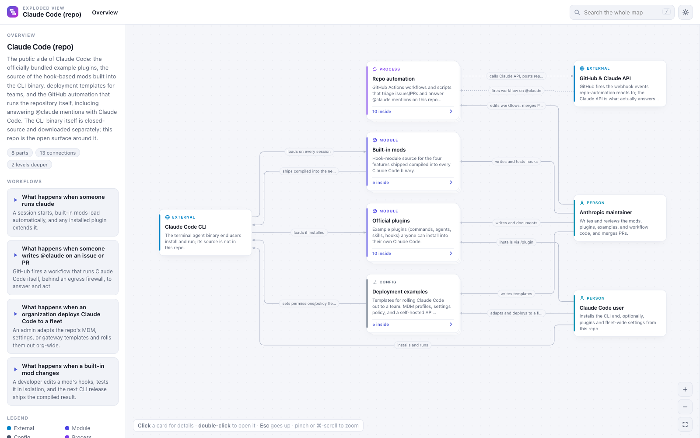
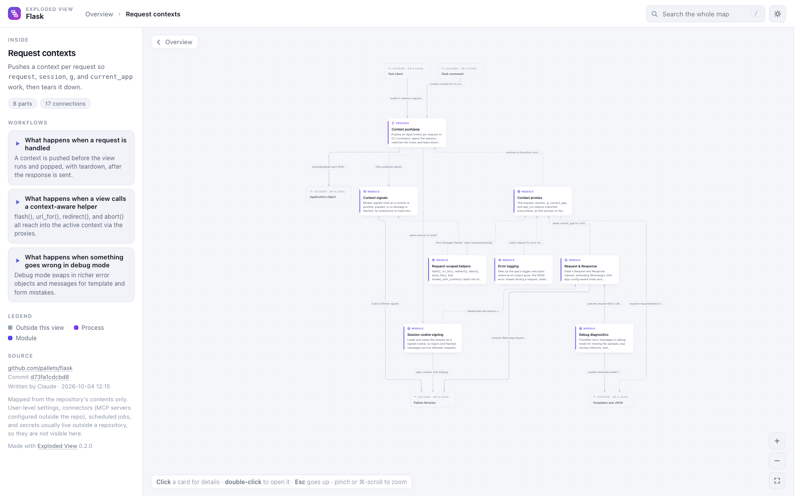

# Exploded View

Point it at a repository and get an interactive map of how the thing works: a readable top level, parts you can open to see inside, connections labelled with what moves between them, and workflows you can play step by step.

It is a Claude Code plugin. Your own Claude Code session writes the map, so there is no API key, nothing is hosted, and nothing leaves your machine except what your session already sends to Claude. The result is one self-contained HTML file that opens in any browser, offline.

It maps ordinary codebases and agent harnesses alike. In a Claude Code setup, instruction files, skills, hooks, MCP servers, scheduled jobs, and the person running it all show up as first-class parts, with the session lifecycle as a workflow.





The maps behind these pictures are in [`examples/`](examples/): download an `index.html` and open it.

## Install

In Claude Code:

```
/plugin marketplace add tmedia-csb/exploded-view
/plugin install exploded-view@exploded-view
```

Or from a shell:

```bash
claude plugin marketplace add tmedia-csb/exploded-view
claude plugin install exploded-view@exploded-view
```

It needs Python 3.9 or newer and `git`. Nothing else: the engine uses only the Python standard library.

## Use

```
/exploded-view:map https://github.com/pallets/flask
/exploded-view:map ~/code/my-project
/exploded-view:map owner/repo --depth 3
```

You can also just ask: "map this repo with Exploded View."

- **GitHub URLs** work in their usual forms, including `/tree/<branch>/<folder>` links to map one folder. Other git URLs work too.
- **Private repos** are cloned with your own `git`, so they work wherever `git clone` works for you (a credential helper, `gh auth setup-git`, or an SSH key). Exploded View never asks for a token.
- **Local folders** are read in place.
- `--depth N` sets how many levels of drill-in sit below the top level (default 2). `--fresh` ignores parts cached from an earlier run on the same commit.

The map lands in `~/exploded-view/<name>/index.html` and opens in your browser. Share that one file; the rest of the folder is working state.

## Reading a map

- **Click** a card for its details, connections, and key files. On GitHub maps, key files link to the exact commit.
- **Double-click** a stacked card, or press Enter, to open it. **Esc** goes back up.
- **Dashed cards** inside a drill-in are its neighbours one level up. Click one to jump to it.
- **Workflows** are on the left. Pick one to play it: each hop pulses along its connection and the parts are numbered in order. Arrow keys step, space pauses.
- **`/`** searches every level. **`F`** fits the map to the screen. Pinch or ⌘-scroll zooms.
- The URL tracks where you are, so a link can point straight at a drill-in.

## How it works

1. **Prepare.** The engine resolves the target, shallow-clones it if it is remote, and scans it: every file `git` tracks, short summaries from docstrings and header comments, resolved imports and links, and the harness parts it can detect. It writes a compact digest.
2. **Overview.** Your session reads the digest and a few key files, then writes the top level: 5–10 parts, the connections between them, and the main workflows. Each part that hides real structure gets a scope.
3. **Drill-ins.** Each scoped part goes to its own subagent, in parallel, which reads that part's files and writes its inside. Deeper levels follow the same way.
4. **Merge.** The engine assembles the parts, validates them, strips anything that looks like a secret or a local home-folder path, and renders the HTML.

Your main session only ever holds the digest, the rules, and the top level. Drill-ins stay in subagents and the finished map is never read back into the conversation, so large repos don't fill your context. Small repos (about 40 files or fewer) are written in one pass.

Parts are cached by commit, so a second run on an unchanged repo reuses everything already written.

## What a map can and can't see

A cloned repository is mapped from its contents only. User-level settings, MCP servers configured outside the repo, scheduled jobs, and secrets usually live outside a repository, so they aren't in the map, and the map says so in its Source section.

A local folder can show more: Exploded View also reads this machine's user-level Claude Code hooks, an untracked `.mcp.json`, and launchd jobs that point into the folder, and labels each one as machine config. It never does this for a clone, so mapping someone else's repo can't leak your own setup into it.

## Privacy

- Scans use `git ls-files`, so ignored files stay out.
- Summaries, the digest, and the finished map pass through a redactor that strips anything shaped like a key, token, password assignment, UUID, or email address, and replaces absolute home-folder paths with `~`.
- The authoring rules tell Claude to describe mechanisms, not contents: never credentials, identifiers, or personal details.
- The map's working folder (`scan.json`, prompts) contains local paths. Share `index.html`, not the folder.

## Without the plugin

The engine is a plain Python script, so it also works on its own:

```bash
python3 engine/explodedview.py static <target>     # a map from folders, imports, and links alone (no AI)
python3 engine/explodedview.py prompt <target>     # a one-pass prompt any Claude session can follow
python3 engine/explodedview.py render map.json --open
python3 engine/explodedview.py validate map.json
```

The static map shows structure rather than behaviour. The difference is the reason the AI path exists.

## The map format

`map.json` is `{title, summary, root}`. A graph is `{nodes, edges, flows}`, and any node can carry `children`, another graph. Edges inside a child can reach a neighbour one level up as `../id`, two levels up as `../../id`. Node kinds: entry, module, process, service, ui, data, config, external, person, agent, skill, hook, schedule, doc, test, group. A node can be marked `planned` or `deprecated`. The full schema and the modelling rules are the `SCHEMA_DOC` and `RULES` constants in `engine/explodedview.py`. `examples/` holds finished maps of public repositories.

## Files

- `skills/map/SKILL.md`: what Claude follows when you run the command.
- `engine/explodedview.py`: resolver, scanner, prompts, merge, validator, redactor, renderer, and the static mapper.
- `engine/viewer.html`: the viewer template.
- `engine/vendor/elk.bundled.js`: the [ELK](https://github.com/kieler/elkjs) layout engine, inlined into each map. See `engine/vendor/NOTICE.md`.
- `examples/`: maps of public repositories, plus Exploded View mapping itself.

## License

MIT. See [LICENSE](LICENSE).

The vendored ELK layout engine (`engine/vendor/elk.bundled.js`) is a separate work under the Eclipse Public License 2.0; see `engine/vendor/NOTICE.md`.
